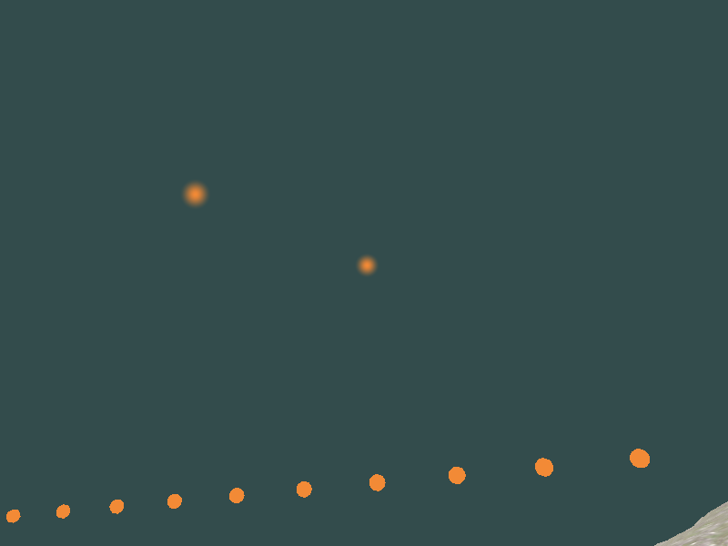
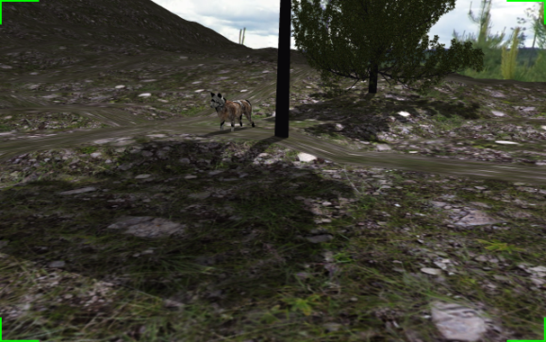
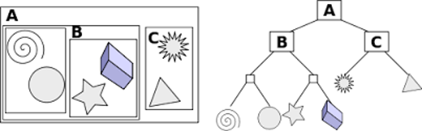
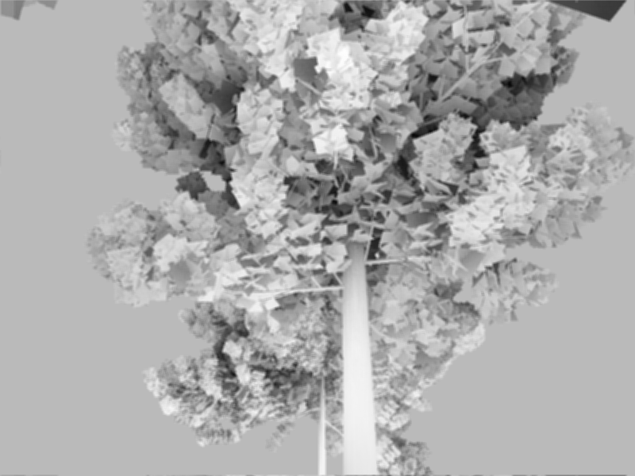
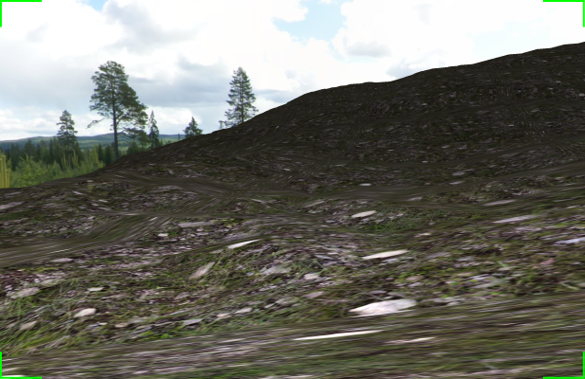

# Introduction

WolfQuest is a wolf simulation game, developed by eduweb. It is especially popular among teenagers. It strives to provide a realistic and immersive simulation of wolf life in Yellowstone National Park. 

We want to create a lightweight version of WolfQuest, called **LiteWQ**. LiteWQ aims to deliver decent wolf simulation experience. It will be a very simple game, with only a few features of original WolfQuest. It will be an excellent final project for Computer Graphics course.

# Features

LiteWQ offers the following features:

- powerful and robust OBJ parser and renderer
- include trees, bushes, grass and wolf model
- scent visualization with glowing effect and wind
- real-time shadow mapping
- real-time collision detection
- experimental SSAO support (not usable yet)
- generate terrain with height map and navigable

## OBJ Parser and Renderer

OBJ parser support the following features:

- vertex, normal, texture coordinate
- mesh group
- material

**TODO: complete this**

## Scent Visualization

There are two kinds of scent in this game: grounded and airborne. Grounded scent is also known as trail, which is simply solid spheres. Grounded scent will emit floating scent randomly. The scent particles flow with wind. The scent particles will fade out after a while. 



The scent particles are semi-transparent spheres, rendered with alpha blending in distance order. The gradual change in alpha is implemented in fragment shader, which computes the distance between the sphere center and fragment position **on screen space**. The fragment shader code is as follows:

```glsl
#version 330 core
out vec4 FragColor;

uniform vec3 center;
uniform vec3 outer;

void main() 
{
    vec3 color = vec3(0.95, 0.54, 0.21);
    vec2 uv = gl_FragCoord.xy - center.xy;
    float dist = length(uv);
    float radius = length(outer - center);
    float alpha = 1.0 - smoothstep(0, radius, dist);
    FragColor = vec4(color, alpha);
}
```

## Real-time Shadow Mapping



**TODO: complete this**

## Real-time Collision Detection



**TODO: complete this**

## Experimental SSAO Support

Screen Space Ambient Occlusion (SSAO) is a technique to simulate ambient occlusion in screen space. It is a very popular technique in modern game engines. SSAO works together with deferred shading. We heavily referenced [LearnOpenGL](https://learnopengl.com/Advanced-Lighting/SSAO) to implement SSAO in our game. However, as of now, SSAO is not usable in our game.

The SSAO algorithm is as follows:

- Render the scene to a G-buffer, which contains position, normal and color information of each fragment.
- Also render the scene to a depth buffer.
- Compute ambient occlusion factor for each fragment in screen space with random samples.
- Apply blur to the ambient occlusion factor to reduce "banding" effect.
- Apply lighting to the scene with ambient occlusion factor.

Here is a screenshot visualizing occusion factor:



It seems pretty good, but somehow when combined with lighting, the result is simply garbage. We are still working on it.

## Generate Terrain with Height Map

Given a bitmap with varying color on various height, we can generate a terrain with it. Simply create a mesh with vertices on the bitmap, and use the color as the Y coordinate. X and Z coordinates are mapped to the bitmap coordinates. The mesh is pre-computed on CPU with uniform grid. This can be improved by utilizing GPU tessellation.

Moreover, to navigate on the terrain, we don't necessarily need to use collision detection. Instead, we can simply rely on the height map, and compute the Y coordinate with bilinear interpolation on the fly. This is much faster than collision detection. The camera will be constrained to the terrain, and will not be able to fly.



# Conclusion

We mainly refer to LearnOpenGL to implement the features of LiteWQ. The game is still not complete yet, so we can work on proper SSAO, first and third person camera, and more gameplay features. We will also try to improve the performance of the game.

In the proposal, we mentioned that we will create a mobile version, but due to the lack of time, we only attempted it at an early stage and abandoned it. We will also try to create a mobile version in the future.
