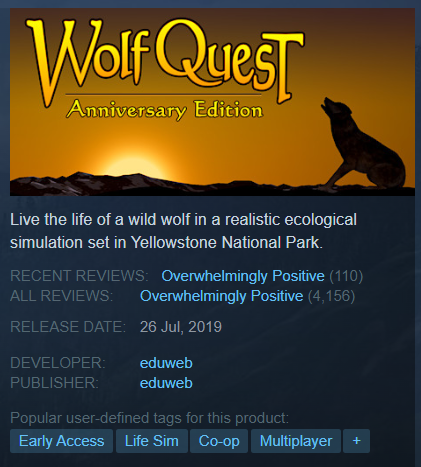
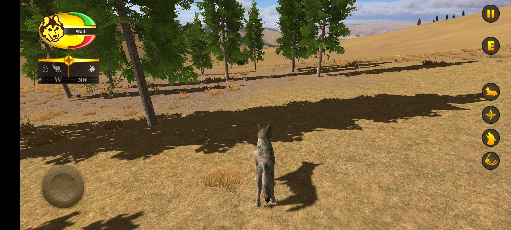
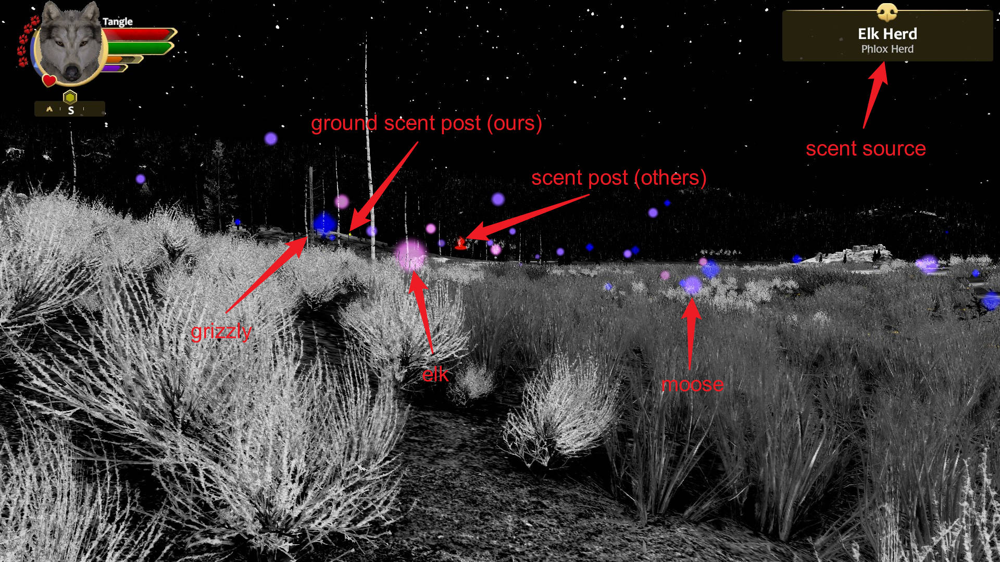
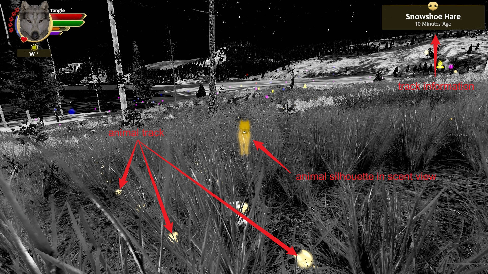
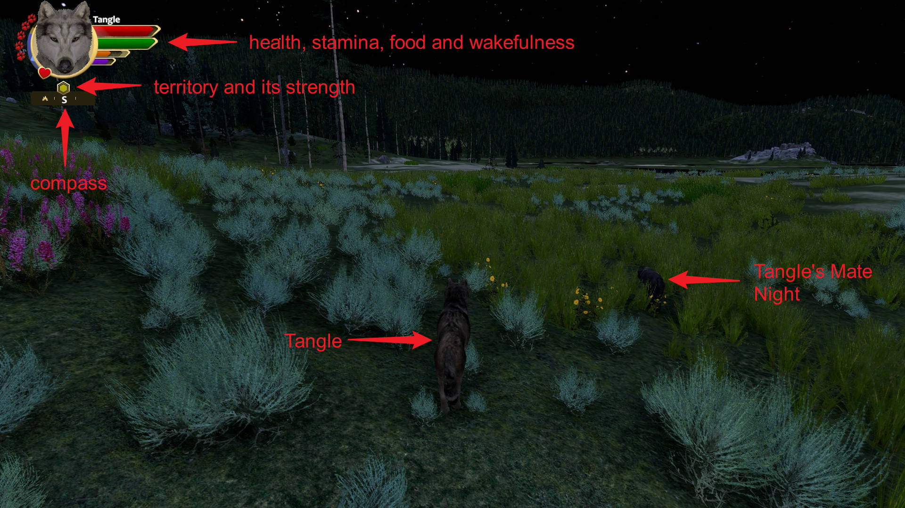

# Introduction

> You are a young gray wolf. Born in the Northern Range of Yellowstone National Park, you learned the ways of the wolf in your family pack. Now you are venturing out on your own — to explore, hunt, find a mate, establish territory, and raise your own family.

WolfQuest is a wolf simulation game, developed by eduweb. It is especially popular among teenagers. It strives to provide a realistic and immersive simulation of wolf life in Yellowstone National Park. WolfQuest: Anniversary Edition is the latest version of the game, a complete remake of WolfQuest Classic (2.x). Though still in Early Access, its graphics and gameplay are already very impressive. You can find the game on [Steam](https://store.steampowered.com/app/926990/WolfQuest_Anniversary_Edition/). 

However, WolfQuest AE doesn't have a mobile version yet, and the available mobile version is based on WolfQuest Classic, which is outdated and has limited graphics. We want to create a mobile version of WolfQuest AE for Android, called **LiteWQ**. It will be a very simple game, with only a few features of original WolfQuest. It will be an excellent final project for Computer Graphics course. 

Note the quality of shadows is a bit low. We will try to improve it.

# Features

LiteWQ is planned to have the following features:

- Build the game engine from scratch, using OpenGL ES 3.0
- Simple 3D model loader
- Render and edit materials and textures
- Simple lighting system
- Navigate the world using a first-person camera
- Gameplay limited to scent view and tracking
- Real-time collision detection (optional)
- Advanced lighting system, including shadows, global illumination, and reflections (optional)

In the original game, scent view allows players to track the scent of preys, predators, and various objects. It is an indispensable part of the game, so we want to implement it in LiteWQ. The scents are represented by floating particles in the air, which drift with the wind. Both animals and their tracks can emit scent particles, so the player can track the animals by following the scent particles. Different colors and shapes of particles represent different animals. Other special symbols represent carcasses, dens, scent posts (used to mark territory), and other objects. In LiteWQ, we will probably only implement limited subset of these features such as tracking carcasses and dens.

In the original game, entering the scent view will cause the world to be rendered in grayscale, so that the player can focus on the scent particles. We will also implement this feature in LiteWQ. However, normal view will not likely to be implemented, because animal animation is difficult. 

# Game Engine

OpenGL ES 3.0 is a subset of OpenGL 3.3, which is the latest version of OpenGL. It is widely supported by mobile devices. OpenGL ES 3.0 is a cross-platform API, so we can use it to develop games for both Android and iOS. 

3D models are stored in the Wavefront OBJ format. We will implement a simple OBJ loader to load 3D models. The OBJ format is very simple, so it is easy to implement.
